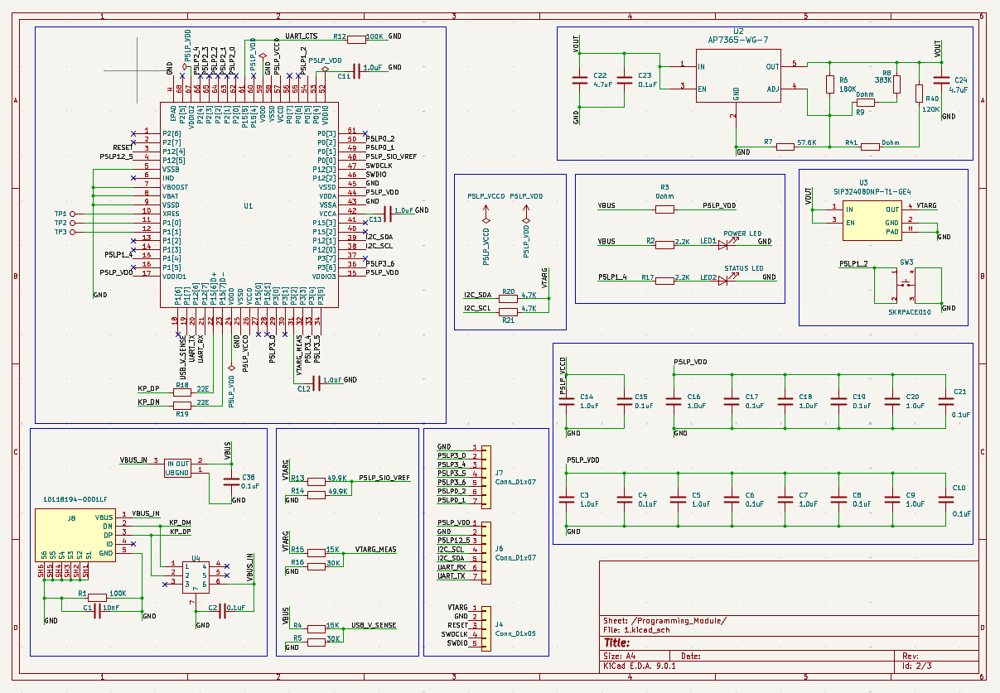
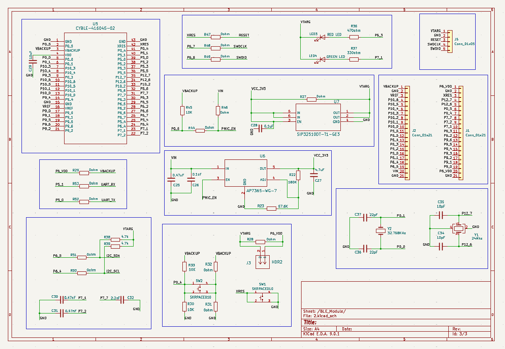
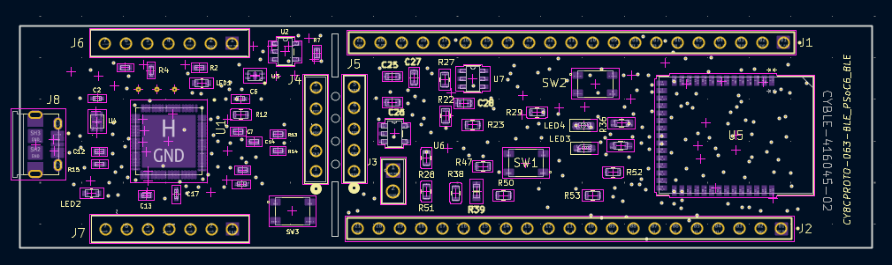
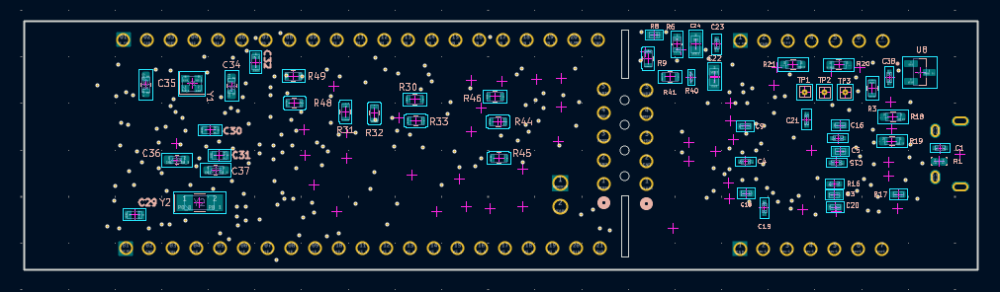
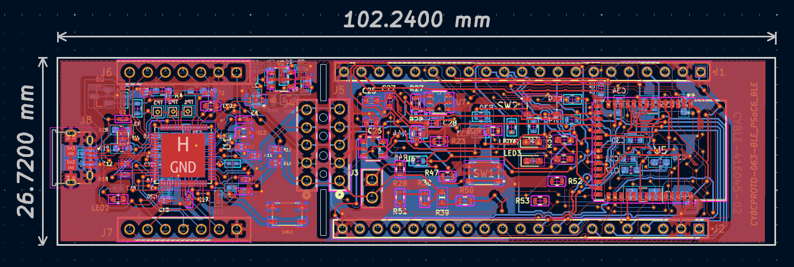
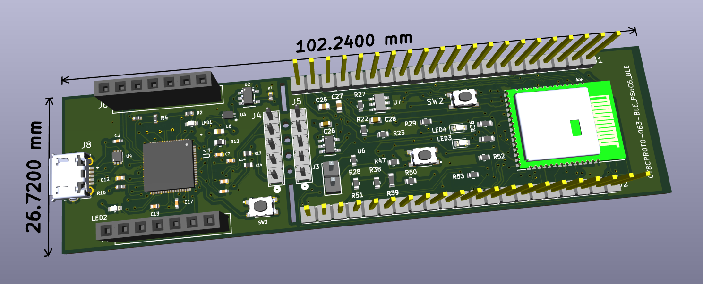
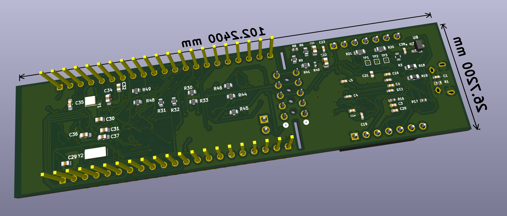

# CY8CPROTO-063-BLE-PSoC-6
A KiCad project that has the schematic and PCB design for the CY8CPROTO-063-BLE_PSoC_6_BLE_Prototyping_Kit

### Original Image of CY8CPROTO-063-BLE-PSoC-6

### Tools Used

## Schematic

### Programming Module

### BLE_Module

## PCB Layout

### Placement of Components

### Overall PCB Layout

## 3D View

### Top View

### Bottom View

## License

This project is licensed under the MIT License. See the [LICENSE](LICENSE) file for details.